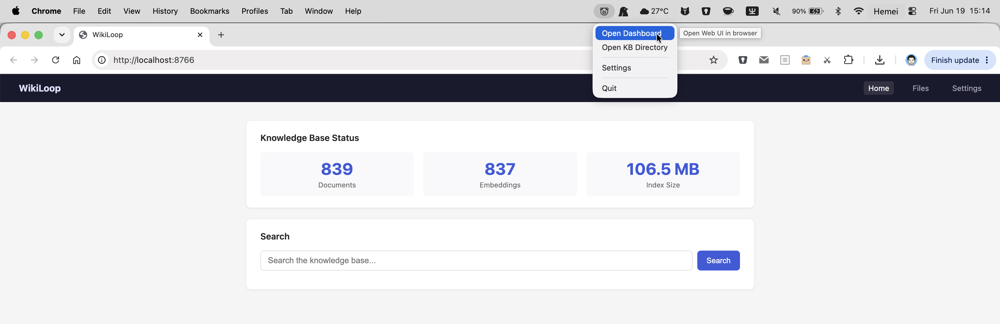

<div align="center">
  <br>
  <h1>WikiLoop</h1>
  <p>A knowledge search engine for agents — distill raw docs into structured Markdown wiki, search and read via MCP</p>
  <p><a href="docs/readme/README.zh-CN.md">中文文档</a></p>
  <p>
    <a href="LICENSE"></a>
    <a href="https://github.com/jasen215/wikiloop/releases"></a>
    
    
  </p>
</div>

WikiLoop is a local-first knowledge search engine for agents. It distills raw documents into a structured, reviewable Markdown wiki, then exposes two MCP tools — `kb_search` and `kb_page` — that let agents search and deep-read at their own pace.



## Design Philosophy

WikiLoop is built around one observation: **agents use external knowledge tools the same way humans use search engines** — they issue multiple queries from different angles, follow links, and synthesize their own conclusions. They do not want a pre-packaged answer; they want the raw materials to form their own.

This means WikiLoop's job is not to answer questions. It is to make sure that when an agent searches for something, it finds the right documents — and can read them in full.

```text
wikiloop-kb/
  raw/                  Source of truth — original materials in any format.
                        Drop files here; the watcher auto-distills them.

  wiki/                 Structured Markdown knowledge layer (LLM-maintained).
    source-notes/       One distilled note per raw document. FTS search target.
    concepts/           Cross-document synthesis: concepts and methodologies.
    comparisons/        Cross-document synthesis: side-by-side comparisons.
    decisions/          Cross-document synthesis: technical decisions.
    _draft/             Synthesized pages with < 2 sources (not indexed yet).

  schema/               KB-local authoring rules and page templates.
                        Edit these to customize the distilled page format.

  index/                Generated artifacts (SQLite FTS index, query logs).
                        Managed automatically — do not edit manually.
```

## How Agents Use WikiLoop

Agents interact with WikiLoop through two MCP tools:

**`kb_search(query, limit?)`** — Search with a keyword or phrase. Returns up to 5 source-notes and 3 concept/comparison/decision pages per call. Each result includes a `related` field listing linked documents for navigation. Use multiple searches with different keywords to cover a topic from multiple angles.

**`kb_page(ids, full?)`** — Fetch full content of one or more pages by ID (from `kb_search` results). Pass up to 5 IDs to scan several documents at once, or `full=true` with a single ID to get the complete untruncated text.

The recommended agent workflow:

```text
kb_search("keyword A")          → discover relevant documents
kb_search("keyword B")          → cover a different angle
kb_page(["id1", "id2", "id3"]) → deep-read the most relevant ones
Agent synthesizes its own answer from what it found
```

Agents are expected to search iteratively, follow `related` links, cross-verify across sources, and form their own conclusions. WikiLoop does not generate answers.

## WikiLoop vs RAG

Traditional RAG retrieves context and hands it to the LLM to answer. WikiLoop hands the agent raw materials and lets the agent do the reasoning.

```text
RAG:       user question → retrieve context → LLM answers
WikiLoop:  agent searches → agent reads → agent synthesizes
```

| | RAG | WikiLoop |
|---|---|---|
| Knowledge form | Implicit (vectors or chunks) | Explicit (Markdown, auditable) |
| Agent role | Passive receiver of context | Active searcher and reader |
| Answer source | System-generated | Agent-synthesized |
| Auditable | No | Yes — git diff, lint, conflict links |
| Multi-hop reasoning | LLM-dependent | Graph expansion via `related` links |
| Embedding | Required | Not required (pure FTS) |

WikiLoop bundles are conformant with [OKF v0.1](https://github.com/GoogleCloudPlatform/knowledge-catalog/tree/main/okf).

## Knowledge Pipeline

Raw documents flow through a distillation pipeline before agents can search them:

**Step 1 — Distill (automatic)**

Drop any Markdown file into `raw/`. The `wikiloop serve` watcher automatically runs distill + index. The LLM extracts structured source-notes into `wiki/source-notes/`, including:
- `key_claims` with inlined aliases and cross-language equivalents (ALIAS RULE) — ensures FTS matches all query variants
- Named entity annotations in `【entity|type】` format
- `related_to`, `supports`, `contradicts` links — powers the `related` field in search results
- `authority` (1–5) and `doc_type` metadata

**Step 2 — Synthesize (on-demand)**

```bash
wikiloop synthesize --topic "RAG"
```

Generates concept / comparison / decision pages from source-notes when enough sources on a topic accumulate. Pages with fewer than 2 source references go to `wiki/<type>/_draft/` and are not indexed until more sources are added.

**Step 3 — Search**

Agents use `kb_search` + `kb_page` via MCP. Search is pure FTS (SQLite FTS5 with BM25 scoring). No vector model required.

## Installation

Download the latest release:

| Platform | File |
|---|---|
| macOS Apple Silicon | `WikiLoop-<version>-darwin-arm64.dmg` |
| Linux x86_64 | `wikiloop-<version>-linux-amd64.tar.gz` |
| Linux ARM64 | `wikiloop-<version>-linux-arm64.tar.gz` |
| Windows x86_64 | `wikiloop-<version>-windows-amd64.zip` |

**macOS:** Open the DMG and drag WikiLoop to Applications. The app runs as a menubar icon.

**Linux:**
```bash
tar -xzf wikiloop-<version>-linux-amd64.tar.gz -C /path/to/install/
sudo ln -sf /path/to/install/wikiloop /usr/local/bin/wikiloop
```

## Building from Source

Requires Go 1.25+. No CGO required.

```bash
go build -tags fts5 -o wikiloop ./cmd/wikiloop/
```

Or use the multi-platform build script:

```bash
./scripts/build.sh [version] [target...]
```

| Target | Output | Platform |
|---|---|---|
| `darwin-arm64` | `dist/WikiLoop-<version>-darwin-arm64.dmg` | macOS Apple Silicon |
| `linux-amd64` | `dist/wikiloop-<version>-linux-amd64.tar.gz` | Linux x86_64 |
| `linux-arm64` | `dist/wikiloop-<version>-linux-arm64.tar.gz` | Linux ARM64 |

## Repository Structure

```text
wikiloop/
  cmd/wikiloop/        # main entry point
  internal/
    kb/                # FTS indexing, search, graph expansion, page fetch
    mcp/               # MCP server (stdio + HTTP)
    watcher/           # file watcher for auto-distill + reindex
    distill/           # LLM distillation pipeline
    synthesize/        # concept/comparison/decision page generation
    convert/           # raw file conversion
    service/           # OS service manager (launchd / systemd)
    webui/             # web UI
    tray/              # macOS system tray (darwin only)
    config/            # KB config (config.yaml)
  scripts/
    build.sh           # multi-platform build script
```

## Schema & Templates

`wikiloop init` populates the KB's `schema/` directory with bundled authoring rules and page templates:

- `schema/templates/`: Markdown templates for source-note / concept / comparison / decision pages.
- `schema/references/`: authoring rules — page types, citation rules, conflict rules, directory structure.

The distill/synthesize prompts read these templates, so editing them customizes the generated wiki format per-KB.

## Quick Start

```bash
export WIKILOOP_KB=/path/to/your-kb

wikiloop init           # scaffold KB dirs and copy schema/templates
wikiloop serve          # start server: MCP + Web UI + file watcher
wikiloop index          # build/update FTS index
wikiloop status         # index stats
wikiloop lint           # health-check wiki pages
```

## Command Reference

All commands accept a global `--kb <path>` flag (defaults to `$WIKILOOP_KB`, then `~/wikiloop-kb`).

| Command | Description |
|---|---|
| `wikiloop init [--force]` | Scaffold KB dirs and copy bundled schema/templates. |
| `wikiloop serve` | Start the long-running server: HTTP MCP (`/mcp`) + Web UI + file watcher. Default when no subcommand is given. |
| `wikiloop index` | Build/update the FTS index from `wiki/` and `raw/` markdown. |
| `wikiloop search <query>` | FTS keyword search; prints ranked hits with paths and snippets. |
| `wikiloop synthesize [--topic X] [--full]` | Generate concept/comparison/decision pages from source-notes. |
| `wikiloop synthesize --gaps --topic X` | Knowledge-gap analysis for a topic. |
| `wikiloop import-lark <URL>` | Import a Lark/Feishu Wiki page and its embedded tables into `raw/lark/`. Requires a logged-in `lark-cli`. |
| `wikiloop lint` | Health-check wiki pages: missing frontmatter fields, broken source links. |
| `wikiloop status` | Print index stats (document counts, index size). |
| `wikiloop service <install\|uninstall\|start\|stop\|status\|logs>` | Manage the OS service (launchd / systemd). |

**LLM config** (`config.yaml` under KB root, `distill` section) is required for `distill` and `synthesize`.

## MCP Server

WikiLoop exposes KB tools via the MCP protocol.

**Available tools:** `kb_search`, `kb_page`, `kb_status`, `kb_reindex`, `kb_lint`

---

### Scenario 1: Local Multi-Agent Sharing

HTTP mode is recommended: one WikiLoop process shared by all agents — Claude Code, Cursor, VS Code (Copilot), Windsurf, Trae, Codex, Hermes, OpenClaw, and others.

**Step 1: Start WikiLoop**

```bash
export WIKILOOP_KB=/path/to/wikiloop-kb
wikiloop serve
```

> On macOS, double-click WikiLoop.app to launch as a menubar icon.

**Step 2: Configure HTTP MCP in each agent**

Add to `~/.claude.json` under `mcpServers`:

```json
{
  "mcpServers": {
    "wikiloop": {
      "type": "http",
      "url": "http://127.0.0.1:8766/mcp",
      "headers": {
        "x-api-key": "${WIKILOOP_API_KEY}"
      }
    }
  }
}
```

`x-api-key` corresponds to `server.api_key` in `config.yaml`. Omit `headers` if no api_key is set.

---

### Scenario 2: Hosted Agent Environments

In hosted environments (Hermes, OpenClaw, etc.), install WikiLoop on the persistent volume and invoke via stdio.

Example (NAS-mounted OpenClaw/Hermes, mount point `/root/.openclaw`):

**1. Install to persistent volume (one-time):**

```bash
tar -xzf wikiloop-linux-amd64.tar.gz -C /root/.openclaw/wikiloop/
chmod +x /root/.openclaw/wikiloop/wikiloop
```

**2. MCP configuration:**

Claude Code (`~/.claude.json`):

```json
{
  "mcpServers": {
    "wikiloop": {
      "command": "/root/.openclaw/wikiloop/wikiloop",
      "args": ["serve"],
      "env": {
        "WIKILOOP_KB": "/root/.openclaw/wikiloop-kb"
      }
    }
  }
}
```

Hermes (`mcp_servers` in agent config):

```yaml
mcp_servers:
  wikiloop:
    command: /root/.openclaw/wikiloop/wikiloop
    args: [serve]
    env:
      WIKILOOP_KB: /root/.openclaw/wikiloop-kb
```

## System Service (optional)

`wikiloop serve` includes a built-in watcher that automatically monitors the KB directory, triggers distill, and rebuilds the index. No additional setup required.

To make WikiLoop **start on boot and run in the background**, install it as a system service (macOS launchd / Linux systemd):

```bash
wikiloop service install --kb /path/to/your-kb
wikiloop service status
wikiloop service uninstall
```

Logs: `{WIKILOOP_KB}/index/watcher.log`
